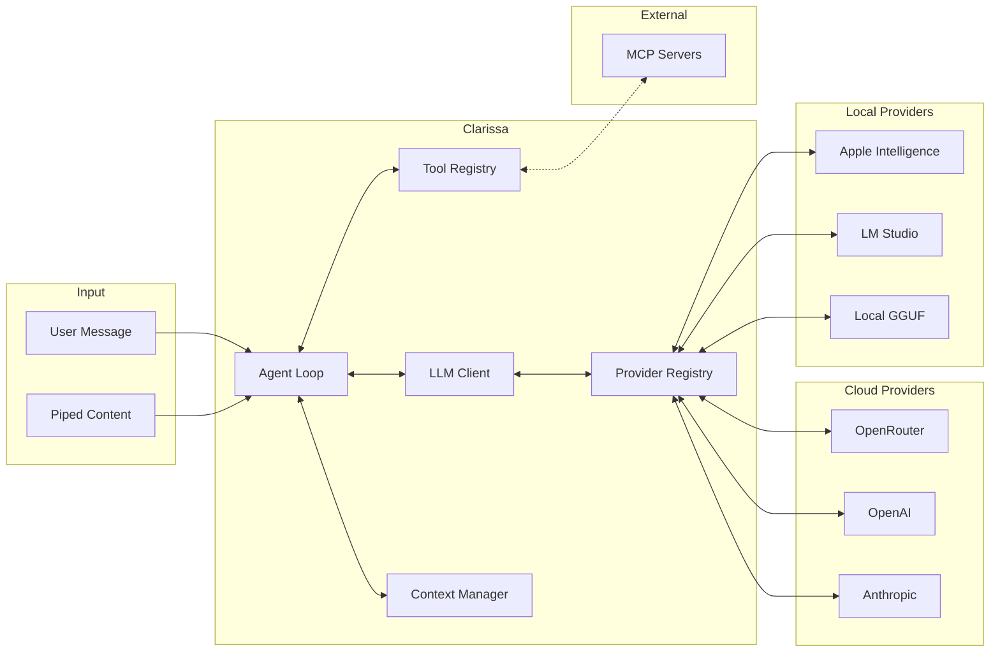
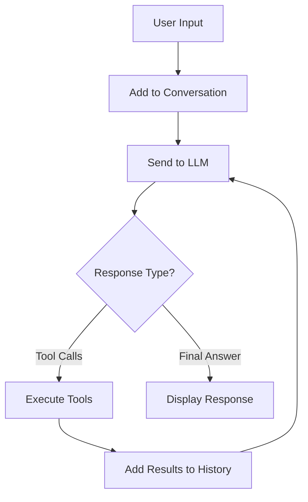

<p align="center">
  
</p>

<h1 align="center">Clarissa</h1>

<p align="center">
  An AI-powered terminal assistant with tool execution capabilities
</p>

<p align="center">
  <a href="https://www.npmjs.com/package/clarissa"></a>
  <a href="https://www.npmjs.com/package/clarissa"></a>
  <a href="https://github.com/cameronrye/clarissa/blob/main/LICENSE"></a>
  <a href="https://github.com/cameronrye/clarissa/actions/workflows/release.yml"></a>
  <a href="https://bun.sh"></a>
  <a href="https://www.typescriptlang.org"></a>
  <a href="#"></a>
  <a href="#"></a>
  <a href="https://github.com/cameronrye/clarissa"></a>
  <a href="https://github.com/cameronrye/clarissa/issues"></a>
  <a href="https://github.com/cameronrye/clarissa"></a>
  <a href="https://github.com/cameronrye/clarissa/pulls"></a>
</p>

---

Clarissa is a command-line AI agent built with [Bun](https://bun.sh) and [Ink](https://github.com/vadimdemedes/ink). It supports multiple LLM providers including cloud services (OpenRouter, OpenAI, Anthropic) and local models (Apple Intelligence, LM Studio, GGUF via node-llama-cpp). The agent can execute tools, manage files, run shell commands, and integrate with external services via the Model Context Protocol (MCP).

## Features

- **Multi-provider support** - Cloud (OpenRouter, OpenAI, Anthropic) and local (Apple Intelligence, LM Studio, GGUF) providers
- **Multi-model support** - Switch between Claude, GPT-4, Gemini, Llama, DeepSeek, and 100+ models
- **Apple Intelligence** - On-device AI with Apple Foundation Models on macOS 26+ with full tool calling
- **Local model inference** - Download and run GGUF models directly via node-llama-cpp
- **Streaming responses** - Real-time token streaming for responsive conversations
- **Built-in tools** - File operations, Git integration, shell commands, web fetching, and more
- **MCP integration** - Connect to external MCP servers to extend functionality
- **Session management** - Save and restore conversation history
- **Memory persistence** - Remember facts across sessions with `/remember` and `/memories`
- **Context management** - Automatic token tracking and context truncation
- **Tool confirmation** - Approve or reject potentially dangerous operations
- **One-shot mode** - Run single commands directly from your shell
- **Piped input** - Pipe content from other commands for processing
- **Auto-update** - Check for and install updates with `clarissa upgrade`

## How It Works

Clarissa implements the **ReAct (Reasoning + Acting) agent pattern**, where an LLM reasons about tasks and takes actions through tool execution in an iterative loop.

### Architecture Overview



The system connects your terminal to various LLM providers. When you ask Clarissa to perform a task, it:

1. Sends your message to the LLM along with available tool definitions
2. Receives a response that may include tool calls (e.g., read a file, run a command)
3. Executes the requested tools and feeds results back to the LLM
4. Repeats until the LLM provides a final answer

### The ReAct Loop



This loop continues until the LLM responds without requesting any tools, indicating it has completed the task. A maximum iteration limit prevents infinite loops.

### Key Concepts

| Concept | Description |
|---------|-------------|
| **Tool Confirmation** | Potentially dangerous tools (file writes, shell commands) require approval before execution. Use `/yolo` to auto-approve. |
| **Context Management** | Clarissa tracks token usage and automatically truncates older messages when approaching the model's context limit. |
| **Session Persistence** | Conversations can be saved to `~/.clarissa/sessions/` and restored later with `/save` and `/load`. |
| **Memory System** | Use `/remember` to store facts that persist across sessions and are included in every conversation. |
| **MCP Extensibility** | Connect to [Model Context Protocol](https://modelcontextprotocol.io/) servers to add custom tools without modifying Clarissa's code. |

For detailed architecture documentation, see the [Architecture Guide](https://cameronrye.github.io/clarissa/docs/architecture/).

## Requirements

- [Bun](https://bun.sh) v1.0 or later (for running from source or npm install)
- At least one LLM provider:
  - [OpenRouter API key](https://openrouter.ai/keys) (100+ models)
  - [OpenAI API key](https://platform.openai.com/api-keys) (GPT models)
  - [Anthropic API key](https://console.anthropic.com/settings/keys) (Claude models)
  - Apple Intelligence (macOS 26+ with Apple Silicon)
  - [LM Studio](https://lmstudio.ai) (local server)
  - Local GGUF model (via `clarissa download`)

## Installation

### From npm (recommended)

```bash
# Using bun
bun install -g clarissa

# Using npm
npm install -g clarissa
```

### From source

```bash
git clone https://github.com/cameronrye/clarissa.git
cd clarissa
bun install
bun link
```

### Standalone binary

Download a pre-built binary from the [releases page](https://github.com/cameronrye/clarissa/releases) and add it to your PATH:

```bash
# Example for macOS ARM
chmod +x clarissa-macos-arm64
mv clarissa-macos-arm64 /usr/local/bin/clarissa
```

## Configuration

### Quick Setup

Run the interactive setup to configure your API keys:

```bash
clarissa init
```

This will prompt you for API keys for OpenRouter, OpenAI, and Anthropic. You can skip any provider you don't want to use.

### Manual Configuration

Create a config file at `~/.clarissa/config.json`:

```json
{
  "openrouterApiKey": "sk-or-...",
  "openaiApiKey": "sk-...",
  "anthropicApiKey": "sk-ant-...",
  "provider": "openrouter",
  "model": "anthropic/claude-sonnet-4"
}
```

Or set API keys as environment variables:

```bash
export OPENROUTER_API_KEY=sk-or-...
export OPENAI_API_KEY=sk-...
export ANTHROPIC_API_KEY=sk-ant-...
```

### Configuration Options

| Config Key | Env Variable | Description |
|------------|--------------|-------------|
| `openrouterApiKey` | `OPENROUTER_API_KEY` | OpenRouter API key (100+ models) |
| `openaiApiKey` | `OPENAI_API_KEY` | OpenAI API key (GPT models) |
| `anthropicApiKey` | `ANTHROPIC_API_KEY` | Anthropic API key (Claude models) |
| `provider` | - | Preferred provider (auto-detected if not set) |
| `model` | `OPENROUTER_MODEL` | Default model to use |
| `localModelPath` | - | Path to local GGUF model file |
| `maxIterations` | `MAX_ITERATIONS` | Maximum tool iterations (default: 10) |
| `debug` | `DEBUG` | Enable debug logging |
| `mcpServers` | - | MCP servers to auto-load |

### Providers

Clarissa automatically selects the best available provider based on your configuration:

| Provider | Type | Requirements |
|----------|------|--------------|
| `openrouter` | Cloud | API key |
| `openai` | Cloud | API key |
| `anthropic` | Cloud | API key |
| `apple-ai` | Local | macOS 26+, Apple Silicon |
| `lmstudio` | Local | LM Studio running on localhost:1234 |
| `local-llama` | Local | Downloaded GGUF model |

Switch providers with:

```bash
clarissa providers anthropic    # CLI
/provider anthropic             # Interactive
```

### MCP Server Configuration

Add MCP servers to your config file to auto-load them on startup:

```json
{
  "apiKey": "your_api_key_here",
  "mcpServers": {
    "filesystem": {
      "command": "npx",
      "args": ["-y", "@modelcontextprotocol/server-filesystem", "/path/to/dir"]
    },
    "github": {
      "command": "npx",
      "args": ["-y", "@modelcontextprotocol/server-github"],
      "env": { "GITHUB_TOKEN": "your_token" }
    }
  }
}
```

Use `/mcp` to view connected servers and `/tools` to see available tools.

## Usage

### Interactive Mode

Start Clarissa in interactive mode:

```bash
clarissa
```

### One-Shot Mode

Run a single command and exit:

```bash
clarissa "What files are in this directory?"
```

### Piped Input

Pipe content from other commands:

```bash
cat error.log | clarissa "Explain this error"
git diff | clarissa "Write a commit message for these changes"
```

### CLI Commands

| Command | Description |
|---------|-------------|
| `clarissa` | Start interactive mode |
| `clarissa "<message>"` | One-shot query mode |
| `clarissa init` | Set up API keys interactively |
| `clarissa upgrade` | Upgrade to the latest version |
| `clarissa config` | View current configuration |
| `clarissa history` | Show one-shot query history |
| `clarissa providers [NAME]` | List providers or switch to one |
| `clarissa download [ID]` | Download a local GGUF model |
| `clarissa models` | List downloaded models |
| `clarissa use <FILE>` | Set a downloaded model as active |
| `clarissa app "<message>"` | Open macOS app with optional question |

### CLI Options

| Option | Description |
|--------|-------------|
| `-c, --continue` | Continue the last session |
| `-m, --model MODEL` | Use a specific model |
| `--list-models` | List available models |
| `--check-update` | Check for available updates |
| `--debug` | Enable debug output |
| `-h, --help` | Show help |
| `-v, --version` | Show version |

### Interactive Commands

| Command | Description |
|---------|-------------|
| `/help` | Show available commands |
| `/new` | Start a new conversation |
| `/last` | Load the most recent session |
| `/save [NAME]` | Save current session |
| `/sessions` | List saved sessions |
| `/load ID` | Load a saved session |
| `/delete ID` | Delete a saved session |
| `/remember <fact>` | Save a memory |
| `/memories` | List saved memories |
| `/forget <#\|ID>` | Forget a memory |
| `/model [NAME]` | Show or switch the current model |
| `/provider [NAME]` | Show or switch the LLM provider |
| `/mcp CMD ARGS` | Connect to a stdio MCP server |
| `/mcp sse URL` | Connect to an HTTP/SSE MCP server |
| `/tools` | List available tools |
| `/context` | Show context window usage |
| `/yolo` | Toggle auto-approve mode |
| `/version` | Show version info |
| `/upgrade` | Upgrade to latest version |
| `/exit` | Exit Clarissa |

### Keyboard Shortcuts

| Shortcut | Action |
|----------|--------|
| `Ctrl+C` | Cancel current operation / Exit |
| `Ctrl+P` | Enhance prompt with AI |
| `Up/Down` | Navigate input history |

### Built-in Tools

**File Operations**
- `read_file` - Read file contents
- `write_file` - Write or create files
- `patch_file` - Apply patches to files
- `list_directory` - List directory contents
- `search_files` - Search for files by pattern

**Git Integration**
- `git_status` - Show repository status
- `git_diff` - Show changes
- `git_log` - View commit history
- `git_add` - Stage files
- `git_commit` - Commit changes
- `git_branch` - Manage branches

**System**
- `bash` - Execute shell commands
- `calculator` - Perform calculations

**Web**
- `web_fetch` - Fetch and parse web pages

### File Context References

Reference files directly in your prompts using `@filename` syntax:

```
Explain what @src/index.ts does
Review @package.json:1-20 for issues
Compare @README.md with @CHANGELOG.md
```

### MCP Integration

Connect to Model Context Protocol servers to extend Clarissa with additional tools:

```bash
# Stdio server (local process)
/mcp npx -y @modelcontextprotocol/server-filesystem /path/to/directory

# HTTP/SSE server (remote URL)
/mcp sse https://mcp.example.com/api
```

## Development

Run with hot reloading:

```bash
bun run dev
```

Run tests:

```bash
bun test
```

### Building Binaries

Build for your current platform:

```bash
bun run build:current
```

Build for all platforms:

```bash
bun run build:all
```

Binaries are output to the `dist/` directory.

### Publishing to npm

```bash
npm publish
```

## Project Structure

```
src/
  index.tsx        # CLI entry point
  agent.ts         # ReAct agent loop implementation
  update.ts        # Auto-update functionality
  config/          # Environment configuration
  history/         # One-shot query history
  llm/             # LLM client and context management
    providers/     # Multi-provider abstraction (OpenRouter, OpenAI, Anthropic, Apple, etc.)
  mcp/             # MCP client integration
  memory/          # Long-term memory persistence
  models/          # Local model download and management
  preferences/     # User preferences persistence
  session/         # Session persistence
  tools/           # Tool definitions
  ui/              # Ink UI components
```

## License

MIT

---

Made with ❤️ by [Cameron Rye](https://rye.dev)
